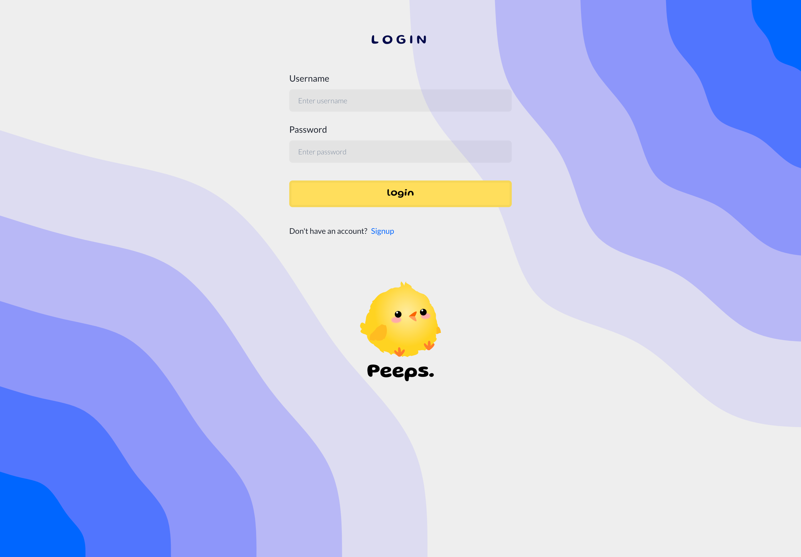
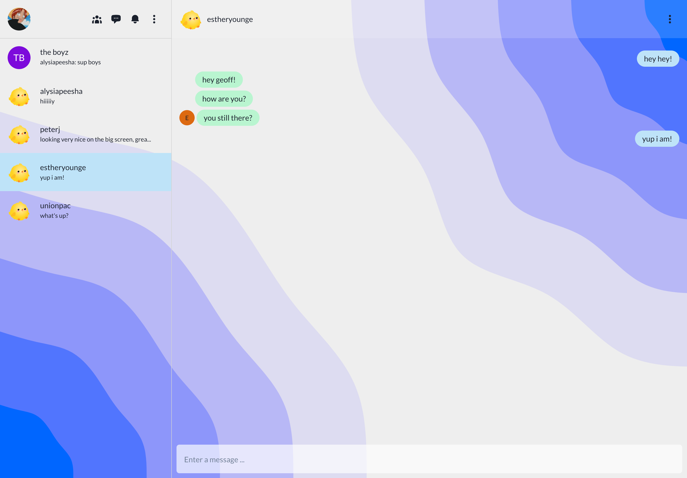
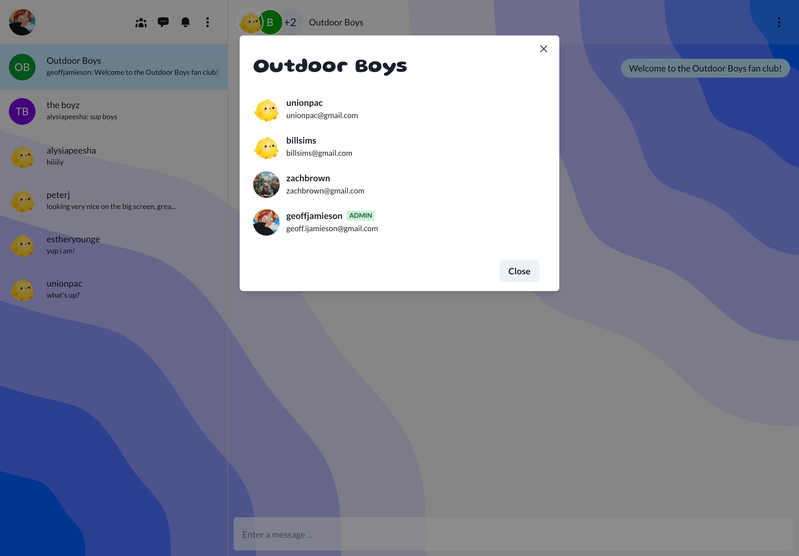

# Peeps 🐥

Realtime chat app that allows users to connect and create group chats.

## Table of contents

- [Overview](#overview)
  - [Description](#description)
  - [Project Goal](#project-goal)
  - [Screenshots](#screenshots)
  - [Links](#links)
- [My process](#my-process)
  - [Tech Stack](#tech-stack)
- [Author](#author)

## Overview

### Description

A realtime chat application that allows users to connect with friends and family. Supports single chat and group chats, easy tools to manage your groups, and profile customizability. Peeps has been built with the purpose of providing a wonderful and easy experience for its users, so that they can focus on what's important - building and fostering connections.

### Project Goal

The goal and purpose for this project was to learn about web sockets.

##### 💭 Introspection

Earlier in my professional career I started my own business called Koji Street and worked with a development team to bring the idea to life (I was the primary designer on the team). Since I have been in web development, I think somewhere in the back of my brain, I have been motivated to learn all the intricacies of the old Koji Street marketplace. One of the features was the ability to chat with other users on the platform (intended as a way to let buyers and sellers negotiate and to learn more about artwork from the artist). Eventually I would like to build a marketplace as a side project and now having this knowledge of creating chat functionality I can implement that into my future marketplace project.

### Screenshots

### Links

- [Live Demo]()

## My process

### Tech Stack

**Frontend**

- React
- Vite
- ChakraUI
- Formik
- Yup (form validation)
- Socket.io client

**Backend**

- Express
- MongoDB
- Socket.io
- Cloudinary
- JWT (JSON Web Token)

## Author

- Website - [Geoff Jamieson](https://www.geoffjamieson.com/)
- LinkedIn - [linkedin/geoffjamieson](https://www.linkedin.com/in/geoffjamieson/)
